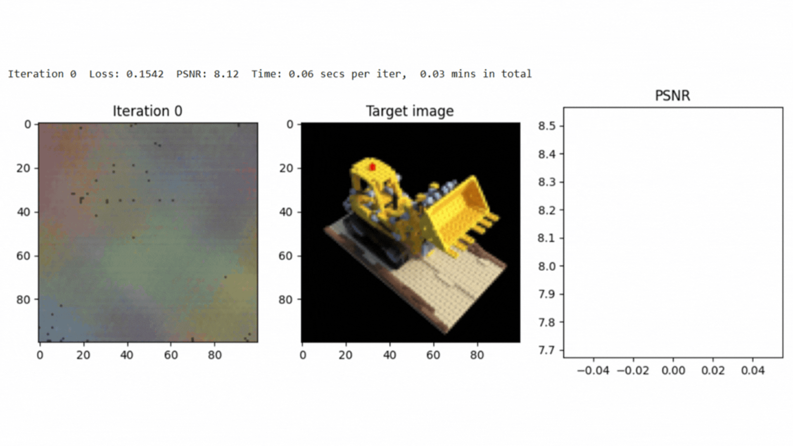

# 3D Scene Reconstruction & Novel View Rendering With NeRF (Neural Radiance Fields)

Neural Radiance Fields (NeRF) are powerful tools for 3D scene reconstruction. This project focuses on employing NeRF to represent scenes as mappings of 3D positions and viewing directions to RGB color and density. By leveraging positional encoding and efficient rendering techniques, this implementation enhances the quality and realism of synthesized scenes.

A detailed description about the project can be found here: 

